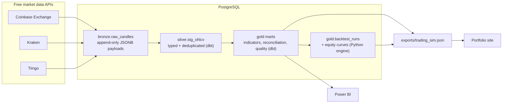

# market-data-medallion

A free-tier, production-shaped market data platform: public market APIs → PostgreSQL medallion
architecture (bronze/silver/gold with dbt) → an honest Python backtesting engine → daily automated
refresh on GitHub Actions, feeding JSON to a live portfolio site.

[](https://github.com/DavinsonR/market-data-medallion/actions/workflows/ci.yml)
[](LICENSE)

## Why this project

This is a build-in-public portfolio project. Everything here runs on a $0 budget (free API tiers,
free CI minutes, a free Postgres), and the point is not the trading strategies — it is the
engineering around them: idempotent ingestion, layered SQL modeling, tests at every boundary,
backtests that refuse to cheat, and automation that keeps itself alive without a server.

The gold-layer output is exported as JSON and consumed by my portfolio site:
**<https://proyecto-davirson-git.vercel.app>**

## Architecture



Four assets, daily candles: `BTC-USD` and `ETH-USD` (Coinbase primary, Kraken for cross-exchange
reconciliation) and `SPY` / `QQQ` (Tiingo). Assets, sources, strategies, and cost assumptions live
in one declarative file: [`config.yaml`](config.yaml).

### Medallion layers

| Layer | Schema | Written by | Contents |
|---|---|---|---|
| Bronze | `bronze` | Python (psycopg 3) | Raw API payloads as untouched JSONB, append-only; natural key `(source, symbol, granularity, candle_ts)` with `ON CONFLICT DO NOTHING` makes re-ingestion idempotent |
| Silver | `silver` | dbt | Payloads parsed per source into typed OHLCV columns, quality-flagged, then deduplicated to one row per `(symbol, ts)` with source priority Coinbase > Kraken > Tiingo |
| Gold | `gold` | dbt + backtest engine | Indicator mart (SMA 20/50/200, Cutler's RSI-14, Bollinger 20/2σ, daily returns), source reconciliation, data-quality mart, asset summary; plus backtest runs and equity curves written by the Python engine |
| Meta | `meta` | Python | `ingest_runs` audit log — one row per ingestion attempt, success **or** failure |

Timestamps are timezone-aware UTC everywhere; a candle's `ts` is the bar **open** time.

## Data quality framework

Market data is messier than tutorials admit. This repo treats the mess as a first-class feature:

- **Missing days.** Crypto trades every calendar day, equities only on weekdays.
  `gold.mart_data_quality` compares expected vs. actual days per symbol and reports missing days
  and the largest gap, instead of silently interpolating.
- **Cross-exchange reconciliation.** BTC and ETH are ingested from both Coinbase and Kraken.
  `gold.mart_source_reconciliation` compares daily closes and flags divergences above 0.5%.
  A dbt test warns if the discrepancy rate exceeds 10% — the same price from two venues should
  agree, and when it does not, I want to know before a chart does.
- **Unadjusted equity prices.** Tiingo's raw OHLC for SPY/QQQ is not dividend-adjusted, so equity
  backtests understate total return (dividends are not reinvested). The adjusted close is stored
  in silver (`adj_close`) for reference, and the caveat is stated here rather than hidden.
- **Tests at both boundaries.** dbt schema tests with explicit severities (`error` blocks the
  build: unique/not-null keys, `high >= low`, close within `[low, high]`; `warn` surfaces issues:
  reconciliation discrepancy rate), dbt source freshness on `ingested_at` (warn at 36h, error at
  72h), and pandera schema validation on the DataFrames entering the Python backtester. Every
  ingestion attempt — including failures — is audited in `meta.ingest_runs`.

## Backtesting, honestly

The backtesting engine is deliberately conservative:

- **No look-ahead bias.** A signal computed on bar *t* executes at bar *t+1*'s open — never at the
  close that produced it. A regression test asserts that truncating the future does not change
  past signals.
- **Costs are always on.** Every fill pays a 10 bps fee per side plus 5 bps of adverse slippage
  (buys fill above the open, sells below). The buy-and-hold benchmark pays the same costs.
- **Simple, inspectable strategies.** Four long/flat strategies over daily bars — SMA crossover
  (20/50), MACD (12/26/9), RSI mean-reversion (14, enter < 30 / exit > 50), and a volume-confirmed
  breakout — reported with total return, CAGR, max drawdown, Sharpe, trade count, and win rate.
- **An overfitting warning, in writing.** Four strategies with hand-picked parameters over a few
  years of daily data is an in-sample research exercise, not an investment product. Backtests here
  are a tool for reasoning about pipeline correctness and strategy mechanics — not a promise of
  future returns.

## Orchestration

The daily run is a **Prefect 3** flow executed in-process (`python -m pipeline.flows`):
ingest → dbt build → backtests → JSON export, with retries and structured logging. The scheduler
is a **GitHub Actions cron** (`47 10 * * *` UTC — deliberately off the hour, since GitHub delays
on-the-hour schedules) plus `workflow_dispatch` for manual runs.

**Why not Airflow?** Because this workload is one flow, once a day, on free runners. Airflow would
add a scheduler service, an executor, a metadata database, and a deployment to babysit — real
costs that buy nothing at this scale. Prefect 3 as a library gives the parts that matter (retries,
task structure, observable logs) inside a plain Python process, and GitHub Actions already
provides the cron, the compute, and the run history. Choosing the smallest tool that preserves
observability *is* the engineering decision being demonstrated.

## Quickstart

Requirements: Python 3.12, any PostgreSQL 16+ instance, `psql`, and optionally
[uv](https://docs.astral.sh/uv/).

```bash
# 1. Install dependencies
uv sync --all-extras          # or: python -m venv .venv && .venv/bin/pip install -e ".[dev]"

# 2. Configure the environment
cp .env.example .env          # default DSN: postgresql://mdm@localhost:5433/mdm

# 3. Apply the SQL migrations
make db-migrate               # override the client if needed: make db-migrate PSQL=/path/to/psql

# 4. Run the full daily flow
make run                      # ingest -> dbt build -> backtests -> exports/trading_sim.json
```

`SPY`/`QQQ` need a free `TIINGO_API_KEY` in `.env`; without it, equities are skipped with a
warning and the crypto pipeline still runs end to end.

| Make target | What it does |
|---|---|
| `make setup` | Create `.venv` and install all dependencies (uv preferred, pip fallback) |
| `make db-migrate` | Apply `db/migrations/*.sql` in order via `psql` |
| `make ingest` | Incremental fetch of new candles into bronze (watermark-based) |
| `make dbt-build` | Build and test the silver + gold dbt models |
| `make backtest` | Run all configured strategies against the gold indicator mart |
| `make export` | Write `exports/trading_sim.json` for the portfolio site |
| `make run` | Full daily flow via Prefect 3 (`python -m pipeline.flows`) |
| `make test` | Run the pytest suite |
| `make lint` | Ruff static checks |

## CI/CD

- **[`ci.yml`](.github/workflows/ci.yml)** — on every push/PR to `main`: a `quality` job (ruff +
  pytest, no network, no database) and an `integration` job that boots a `postgres:17` service,
  applies the migrations, seeds deterministic synthetic bronze fixtures, and runs the full
  `dbt build` — models **and** tests — against real SQL.
- **[`daily.yml`](.github/workflows/daily.yml)** — the scheduled refresh: runs the Prefect flow
  and `dbt build` against the hosted database, exports JSON, and auto-commits `exports/*.json`
  when the data changed (`data: daily refresh [skip ci]`). It exits cleanly with a log message on
  forks/clones where secrets are not configured, pings Supabase's REST endpoint to keep the
  free-tier database awake, and uses a keepalive step so GitHub's 60-day inactivity rule never
  silently disables the schedule.

## Repository structure

```
market-data-medallion/
├── config.yaml                  # single config surface: assets, sources, strategies, costs
├── db/
│   └── migrations/              # plain-SQL migrations (bronze, meta, gold engine tables)
├── pipeline/
│   ├── config.py                # config.yaml + .env loading into typed dataclasses
│   ├── models.py                # shared data contracts (Candle, IngestResult)
│   ├── sources/                 # Coinbase, Kraken, Tiingo clients behind one Protocol
│   ├── bronze.py                # watermark-based incremental ingestion (psycopg 3)
│   ├── quality.py               # pandera validation at the Python boundary
│   ├── backtest/                # strategies, next-open execution engine, metrics
│   ├── export.py                # gold marts -> exports/trading_sim.json
│   └── flows.py                 # Prefect 3 flow wiring the daily run together
├── dbt/                         # silver + gold models, schema tests, source freshness
├── exports/                     # committed JSON snapshots consumed by the portfolio site
├── tests/                       # source-parsing fixtures, engine known-answer tests
└── .github/workflows/           # ci.yml, daily.yml
```

## Roadmap

- Interactive strategy playground on the portfolio site, driven by `exports/trading_sim.json`
- Power BI report over the gold marts, committed as a PBIP project
- Longer term: a paper-trading bot reusing the same signal code

## Author

**Davinson Novoa** — [GitHub @DavinsonR](https://github.com/DavinsonR) ·
[proyecto-davirson-git.vercel.app](https://proyecto-davirson-git.vercel.app)
