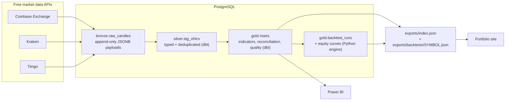

# market-data-medallion

A free-tier, production-shaped market data platform: public market APIs → PostgreSQL medallion
architecture (bronze/silver/gold with dbt) → an honest Python backtesting engine → daily automated
refresh on GitHub Actions, feeding JSON to a live portfolio site.

[](https://github.com/DavinsonR/market-data-medallion/actions/workflows/ci.yml)
[](LICENSE)

## Why this project

This is a build-in-public portfolio project. Everything here runs on a $0 budget (free API tiers,
free CI minutes, a free Postgres), and the point is not the trading strategies — it is the
engineering around them: idempotent ingestion, layered SQL modeling, tests at every boundary,
backtests that refuse to cheat, and automation that keeps itself alive without a server.

The gold-layer output is exported as JSON and consumed by my portfolio site:
**<https://proyecto-davirson-git.vercel.app>**

## Architecture



45 assets, daily candles: 2 crypto (`BTC-USD`, `ETH-USD` — Coinbase primary, Kraken for
cross-exchange reconciliation), 40 listed instruments from Tiingo (broad-market, international and
sector ETFs, US large caps, Latin American ADRs) and 3 FX pairs (`USDCOP`, `USDBRL`, `EURUSD`).
Assets, sources, strategies, combination and split settings, and cost assumptions live in one
declarative file: [`config.yaml`](config.yaml).

### Medallion layers

| Layer | Schema | Written by | Contents |
|---|---|---|---|
| Bronze | `bronze` | Python (psycopg 3) | Raw API payloads as untouched JSONB, append-only; natural key `(source, symbol, granularity, candle_ts)` with `ON CONFLICT DO NOTHING` makes re-ingestion idempotent |
| Silver | `silver` | dbt | Payloads parsed per source into typed OHLCV columns, quality-flagged, then deduplicated to one row per `(symbol, ts)` with source priority Coinbase > Kraken > Tiingo |
| Gold | `gold` | dbt + backtest engine | Indicator mart (SMA 20/50/200, Cutler's RSI-14, Bollinger 20/2σ, daily returns), source reconciliation, data-quality mart, asset summary, strategy leaderboard, per-variant combination analysis and the overfitting summary; plus backtest runs and equity curves written by the Python engine |
| Meta | `meta` | Python | `ingest_runs` audit log — one row per ingestion attempt, success **or** failure |

Timestamps are timezone-aware UTC everywhere; a candle's `ts` is the bar **open** time.

## Data quality framework

Market data is messier than tutorials admit. This repo treats the mess as a first-class feature:

- **Missing days.** Crypto trades every calendar day, equities only on weekdays.
  `gold.mart_data_quality` compares expected vs. actual days per symbol and reports missing days
  and the largest gap, instead of silently interpolating.
- **Cross-exchange reconciliation.** BTC and ETH are ingested from both Coinbase and Kraken.
  `gold.mart_source_reconciliation` compares daily closes and flags divergences above 0.5%.
  A dbt test warns if the discrepancy rate exceeds 10% — the same price from two venues should
  agree, and when it does not, I want to know before a chart does.
- **Unadjusted equity prices.** Tiingo's raw OHLC for SPY/QQQ is not dividend-adjusted, so equity
  backtests understate total return (dividends are not reinvested). The adjusted close is stored
  in silver (`adj_close`) for reference, and the caveat is stated here rather than hidden.
- **Tests at both boundaries.** dbt schema tests with explicit severities (`error` blocks the
  build: unique/not-null keys, `high >= low`, close within `[low, high]`; `warn` surfaces issues:
  reconciliation discrepancy rate), dbt source freshness on `ingested_at` (warn at 36h, error at
  72h), and pandera schema validation on the DataFrames entering the Python backtester. Every
  ingestion attempt — including failures — is audited in `meta.ingest_runs`.

## Backtesting, honestly

The backtesting engine is deliberately conservative:

- **No look-ahead bias.** A signal computed on bar *t* executes at bar *t+1*'s open — never at the
  close that produced it. A regression test asserts that truncating the future does not change
  past signals.
- **Costs are always on.** Every fill pays a 10 bps fee per side plus 5 bps of adverse slippage
  (buys fill above the open, sells below). The buy-and-hold benchmark pays the same costs.
- **Simple, inspectable strategies.** Five long/flat strategies over daily bars, reported with
  total return, CAGR, max drawdown, Sharpe, exposure, trade count, and win rate:

  | Strategy | `config.yaml` name | Long while | Default parameters |
  |---|---|---|---|
  | SMA crossover | `sma_cross` | fast SMA > slow SMA | fast 20, slow 50 |
  | MACD | `macd` | MACD line > signal line | 12 / 26 / 9 |
  | RSI mean-reversion | `rsi_reversion` | entered below 30, held until above 50 | period 14 |
  | Volume-confirmed breakout | `volume_breakout` | price breaks its window high on above-average volume | price 20, volume 20 × 1.5 |
  | Fibonacci retracement | `fibonacci` | close above the 0.618 retracement of the recent swing range | window 100, ratio 0.618 |

  `volume_breakout` is skipped for FX, which has no centralized volume tape — and the skip is
  decided from the data (an all-NaN `volume` column), not from a flag that could drift out of sync
  with reality.
- **An overfitting warning, in writing.** Hand-picked parameters over a few years of daily data is
  a research exercise, not an investment product. Backtests here are a tool for reasoning about
  pipeline correctness and strategy mechanics — not a promise of future returns. The
  [out-of-sample split](#out-of-sample-validation) below is what keeps that warning honest rather
  than decorative.

## Strategy combinations: AND, not OR

Every **non-empty combination** of the five strategies is evaluated as well, with AND semantics:
*long only while every selected signal is green, flat otherwise*. A combination's name is its
components sorted alphabetically and joined with `+`, the same string in the database, the exports
and the site: `macd+volume_breakout`, `fibonacci+macd+sma_cross`.

| Asset group | Applicable strategies | Variants per asset |
|---|---|---|
| 42 assets with volume | 5 | 2⁵ − 1 = **31** |
| 3 FX pairs (no volume) | 4 | 2⁴ − 1 = **15** |
| **45 assets** | | 42 × 31 + 3 × 15 = **1,347 backtests per run** |

**Why AND and not OR.** OR is a union of signals: adding rules can only *increase* the time spent
invested, so an OR lattice drifts toward being always long — it converges on buy & hold with extra
trading costs bolted on, and when a trade happens you cannot say which rule caused it. AND is a
filter: the composite's position is a subset of every component's position, so adding a component
can only *remove* bars. That gives three things OR does not:

1. **Interpretability.** Any difference against the single strategy comes from the bars that were
   filtered out — a question you can answer, not a mixture you cannot decompose.
2. **A built-in failure detector.** Filters shrink exposure, and `exposure` (the fraction of bars
   actually invested) is stored on every run. A five-way AND that is invested 2% of the time is
   not a strategy, however good its return looks; the metric makes that visible instead of letting
   a tiny sample masquerade as an edge.
3. **A monotone lattice.** Because each added component only subtracts, results are comparable
   across combination sizes — which is exactly what
   [`gold.mart_overfitting_summary`](#out-of-sample-validation) aggregates.

Cost is kept linear, not combinatorial: each component's signal is computed **once per asset** and
the 31 variants are elementwise ANDs of those cached series, so five signal computations serve
thirty-one backtests.

### The storage trade-off: combinations keep metrics, not curves

An equity curve costs ~174 KB per run (measured). At 1,347 runs that is ~229 MB per execution, and
the retention policy keeps two generations — ~458 MB against a 500 MB free-tier database. Storing
every curve is therefore not an option, and the honest response is to choose explicitly rather
than to silently truncate history:

- **Single strategies keep their equity curve** (`gold.backtest_runs.has_curve = true`) — 222 runs,
  the ones a visitor actually charts.
- **Combinations store metrics only** (`has_curve = false`) — 1,125 runs. What a per-asset heatmap
  needs is returns, excess returns, exposure and the out-of-sample columns, none of which require
  a curve.

The cost of the choice, stated plainly: you cannot chart a combination's equity path from the
database. Signals are deterministic, so any single combination's curve can be regenerated locally
on demand — a rare, cheap operation compared with paying for 229 MB every day.

## Out-of-sample validation

**Testing ~1,347 variants against one price history and reporting the winner is data dredging.**
With that many draws, some variant will look brilliant by chance alone; that is arithmetic, not
skill. So every run — single and combination alike — is scored on a held-out window it never
influenced:

- **Three genuine backtests per variant.** The full period (which keeps the curve), the
  **in-sample** window (the first `train_fraction` of the bars, default **0.7**) and the
  **out-of-sample** remainder. Each window is an independent run that starts flat with the initial
  cash — no position, equity or trade is carried across the boundary, so the validation window
  cannot inherit a lucky open position from the training window.
- **The split is chronological, never random.** Shuffling daily bars would leak the future into
  the past and quietly invalidate everything; the boundary timestamp is stored per run as
  `split_ts` and exported so a chart can draw it.
- **The out-of-sample window selects nothing.** No parameter, no strategy, no combination is
  chosen using it. It is a report, not a search space — that restraint is the only thing that
  makes the number worth reading.
- **Missing is better than fabricated.** A window with fewer than ~30 bars yields `NULL` metrics
  rather than a figure computed from too little data.
- **The headline honesty metric.** `gold.mart_overfitting_summary` answers, per combination size
  and overall: how many variants beat buy & hold in-sample, how many of those *also* beat it
  out-of-sample, the resulting survival rate, mean exposure, and the average drop from in-sample
  to out-of-sample excess return. It is exported at the top level of `index.json` as
  `overfitting`, so the site can publish the strike-out rate as prominently as the winners.

Declared limitation: one chronological hold-out is the cheapest honest test, not the strongest.
Walk-forward re-fitting or purged cross-validation would be more rigorous; a single split is what
fits a free-tier daily budget, and calling it what it is beats overselling it.

<!-- Results of the first full v3 run (variant counts, survival rate) are filled in by the
     orchestrator once the run has actually executed — do not state numbers before then. -->

## Exports: two tiers, one byte budget

The site is static, so the export is shaped around first paint rather than around what is
convenient to dump:

| File | Contents | Curves |
|---|---|---|
| `exports/index.json` | every configured asset with its summary, data-quality and reconciliation rows, the `strategies` array (singles, headline metrics), the curve-free `combinations` array, the `leaderboard`, the `overfitting` object and pipeline stats | none |
| `exports/backtests/<SYMBOL>.json` | that asset's single-strategy backtests with params and downsampled equity curves (≤ 400 points), its `split_ts`, and the **complete** `combinations` array | singles only |

Each entry of a `combinations` array is one evaluated variant:

| Field | Meaning |
|---|---|
| `strategy` | components sorted and joined with `+` (a plain name when `n_components` is 1) |
| `n_components` | 1–5; **1 marks a single strategy**, so one array renders the whole lattice |
| `exposure` | fraction of bars invested (0–1) — the over-filtering detector |
| `total_return`, `buy_hold_return`, `excess_return` | full period, costs included |
| `is_excess_return`, `oos_excess_return` | the same excess over the training and validation windows |
| `beat_bh_full`, `beat_bh_oos` | did it beat buy & hold over the full period / out of sample |
| `sharpe`, `max_drawdown`, `n_trades` | full-period risk and activity |

**The index has a hard size budget, enforced by measurement rather than by hope.** The payload is
serialized, its real byte length is checked against 600 KB, and only if it is over does each
asset's array collapse to its **top 5 combinations ranked by `oos_excess_return`** — the one figure
that was not used to choose anything, and therefore the only honest way to say "top". When that
happens, `combinations_index.mode` flips from `"full"` to `"top_n"` with
`limit_per_asset: 5`, while every asset keeps its true `n_combinations` count so the site can say
"showing 5 of 31" instead of quietly pretending 5 is all there is. The complete arrays are always
in the per-symbol files, which are fetched on demand anyway.

Whatever the number of assets or variants, the export runs a **constant number of queries** (one
bulk fetch of the latest run per `(symbol, strategy)`, one for all equity curves, one per mart) —
never one per symbol or per strategy. The two dbt-owned marts it reads are optional: each is probed
with `to_regclass` first, so a fresh database exports a null `overfitting` object and falls back to
`gold.backtest_runs` for the combinations instead of crashing. The connection pins
`SET TIME ZONE 'UTC'` before reading anything, because every date label in the JSON is derived from
a `TIMESTAMPTZ` and a server on local time silently shifts them by a day.

## Orchestration

The daily run is a **Prefect 3** flow executed in-process (`python -m pipeline.flows`):
ingest → dbt build → backtests → JSON export, with retries and structured logging. The scheduler
is a **GitHub Actions cron** (`47 10 * * *` UTC — deliberately off the hour, since GitHub delays
on-the-hour schedules) plus `workflow_dispatch` for manual runs.

**Why not Airflow?** Because this workload is one flow, once a day, on free runners. Airflow would
add a scheduler service, an executor, a metadata database, and a deployment to babysit — real
costs that buy nothing at this scale. Prefect 3 as a library gives the parts that matter (retries,
task structure, observable logs) inside a plain Python process, and GitHub Actions already
provides the cron, the compute, and the run history. Choosing the smallest tool that preserves
observability *is* the engineering decision being demonstrated.

## Quickstart

Requirements: Python 3.12, any PostgreSQL 16+ instance, `psql`, and optionally
[uv](https://docs.astral.sh/uv/).

```bash
# 1. Install dependencies
uv sync --all-extras          # or: python -m venv .venv && .venv/bin/pip install -e ".[dev]"

# 2. Configure the environment
cp .env.example .env          # default DSN: postgresql://mdm@localhost:5433/mdm

# 3. Apply the SQL migrations
make db-migrate               # override the client if needed: make db-migrate PSQL=/path/to/psql

# 4. Run the full daily flow
make run                      # ingest -> dbt build -> backtests -> exports/*.json
```

`SPY`/`QQQ` need a free `TIINGO_API_KEY` in `.env`; without it, equities are skipped with a
warning and the crypto pipeline still runs end to end.

| Make target | What it does |
|---|---|
| `make setup` | Create `.venv` and install all dependencies (uv preferred, pip fallback) |
| `make db-migrate` | Apply `db/migrations/*.sql` in order via `psql` |
| `make ingest` | Incremental fetch of new candles into bronze (watermark-based) |
| `make dbt-build` | Build and test the silver + gold dbt models |
| `make backtest` | Run every strategy **and every AND-combination** against the gold indicator mart |
| `make export` | Write `exports/index.json` + `exports/backtests/<SYMBOL>.json` for the portfolio site |
| `make run` | Full daily flow via Prefect 3 (`python -m pipeline.flows`) |
| `make test` | Run the pytest suite |
| `make lint` | Ruff static checks |

## CI/CD

- **[`ci.yml`](.github/workflows/ci.yml)** — on every push/PR to `main`: a `quality` job (ruff +
  pytest, no network, no database) and an `integration` job that boots a `postgres:17` service,
  applies the migrations, seeds deterministic synthetic bronze fixtures, and runs the full
  `dbt build` — models **and** tests — against real SQL.
- **[`daily.yml`](.github/workflows/daily.yml)** — the scheduled refresh: runs the Prefect flow
  and `dbt build` against the hosted database, exports JSON, and auto-commits `exports/*.json`
  when the data changed (`data: daily refresh [skip ci]`). It exits cleanly with a log message on
  forks/clones where secrets are not configured, and pings Supabase's REST endpoint to keep the
  free-tier database awake. GitHub disables a public repo's scheduled workflows after 60 days
  without repository activity; the auto-commit above *is* that activity, because the export
  embeds its generation timestamp and therefore changes on every run. No third-party keep-alive
  action is used: the one this project started with was later blocked by GitHub for a ToS
  violation, and a job whose actions cannot be resolved fails before its first step.

## Repository structure

```
market-data-medallion/
├── config.yaml                  # single config surface: assets, sources, strategies,
│                                #   combinations, train/validation split, costs
├── db/
│   └── migrations/              # plain-SQL migrations (bronze, meta, gold engine tables)
├── pipeline/
│   ├── config.py                # config.yaml + .env loading into typed dataclasses
│   ├── models.py                # shared data contracts (Candle, IngestResult)
│   ├── sources/                 # Coinbase, Kraken, Tiingo clients behind one Protocol
│   ├── bronze.py                # watermark-based incremental ingestion (psycopg 3)
│   ├── quality.py               # pandera validation at the Python boundary
│   ├── backtest/                # strategies + AND-combinations, next-open engine, metrics
│   ├── export.py                # gold marts -> exports/index.json + backtests/<SYMBOL>.json
│   └── flows.py                 # Prefect 3 flow wiring the daily run together
├── dbt/                         # silver + gold models, schema tests, source freshness
├── exports/                     # committed JSON snapshots consumed by the portfolio site
├── tests/                       # source-parsing fixtures, engine and export known-answer tests
└── .github/workflows/           # ci.yml, daily.yml
```

## Roadmap

- Interactive strategy playground on the portfolio site, driven by `exports/index.json` and the
  per-asset combination heatmaps
- Power BI report over the gold marts, committed as a PBIP project
- Longer term: a paper-trading bot reusing the same signal code

## Author

**Davinson Novoa** — [GitHub @DavinsonR](https://github.com/DavinsonR) ·
[proyecto-davirson-git.vercel.app](https://proyecto-davirson-git.vercel.app)
